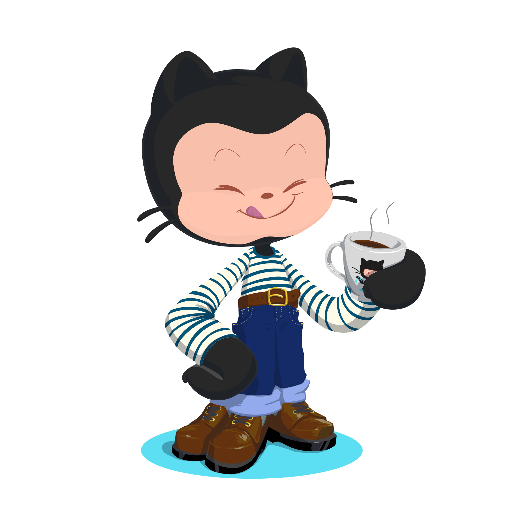

### Hi there 👋

- 🔭 I’m currently working on [RealWorld](https://github.com/gothinkster/realworld)
- 🌱 I’m currently learning [Supabase](https://supabase.io/)
- 💬 Discover my contributions on [Polywork](https://www.polywork.com/gerome)

## 📫 How to reach me

<!--
**geromegrignon/geromegrignon** is a ✨ _special_ ✨ repository because its `README.md` (this file) appears on your GitHub profile.

Here are some ideas to get you started:

- 🔭 I’m currently working on ...
- 🌱 I’m currently learning ...
- 👯 I’m looking to collaborate on ...
- 🤔 I’m looking for help with ...
- 💬 Ask me about ...
- 📫 How to reach me: ...
- 😄 Pronouns: ...
- ⚡ Fun fact: ...
-->
